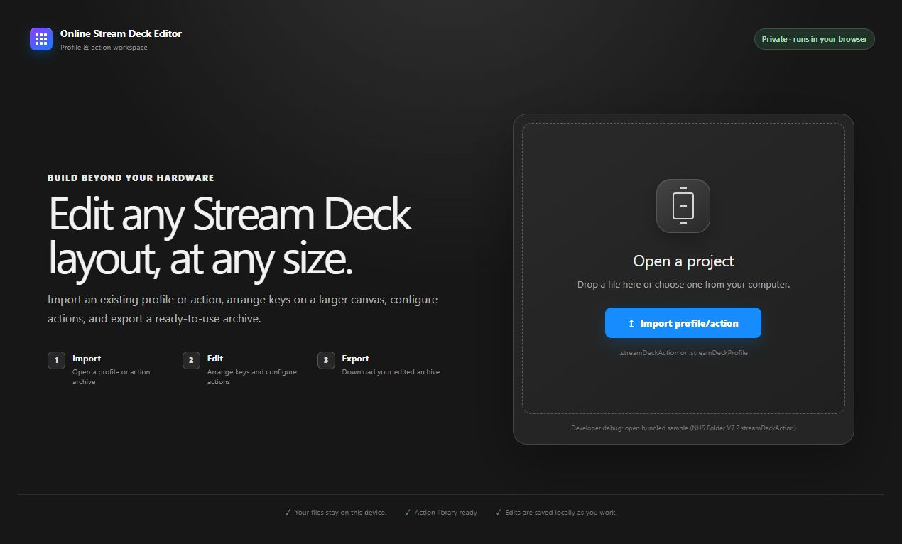
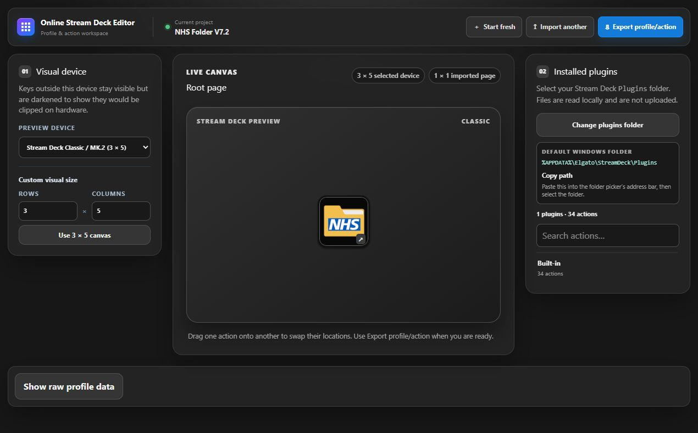
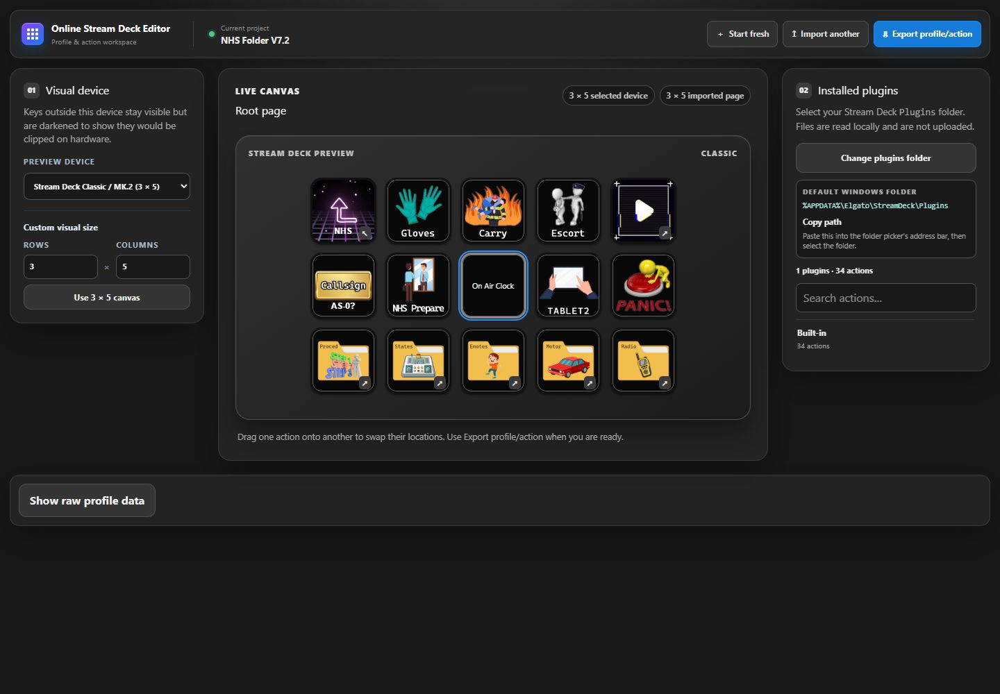
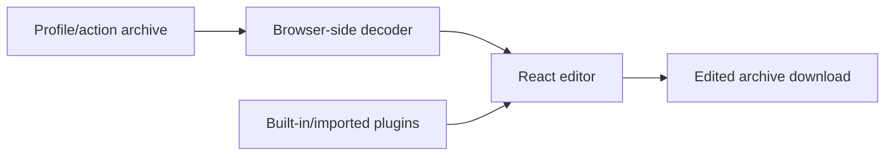

# Online Elgato Stream Deck Editor

<p align="center">
  <a href="https://github.com/KeyErrorFinn/online-elgato-streamdeck-editor/actions/workflows/ci.yml"></a>
  <a href="https://github.com/KeyErrorFinn/online-elgato-streamdeck-editor/commits/main"></a>
  <a href="https://github.com/KeyErrorFinn/online-elgato-streamdeck-editor/issues"></a>
</p>

<p align="center">
  
  
  
  
  
  
  
</p>

A browser-based editor for inspecting and modifying exported Elgato Stream Deck profiles and actions without requiring the Stream Deck desktop editor for every change.

## Features

- Open `.streamDeckProfile` and `.streamDeckAction` archives in the browser.
- Decode linked pages, folders, button states, titles, and images.
- Preview common Stream Deck device grids or a custom grid size.
- Navigate nested folders and edit buttons.
- Import installed plugin archives and browse their available actions.
- Preview supported plugin property inspectors.
- Use bundled Stream Deck built-in actions.
- Persist the current workspace and imported plugins in browser storage.
- Download the edited action/profile archive.

## How it works

The React/TypeScript application reads the selected archive entirely in the browser. Utilities under `src/utils/` decode manifests, profile graphs, plugin directories, images, and property inspectors. `ProfileTester.tsx` coordinates the editor state, page navigation, plugin library, previews, autosaved workspace, and archive export.

No backend is required. The generated site can therefore be deployed as static files. A sample `.streamDeckAction` in `public/` may be discovered at build time and offered as a starter project.

## Development

Requires a current Node.js release and npm.

```bash
npm install
npm run dev
```

Then open the Vite development URL shown in the terminal.

## Validation and production build

```bash
npm run lint
npm run build
npm run preview
```

The build compiles TypeScript and emits the static site to `dist/`. The workflow in `.github/workflows/static.yml` publishes that build.

## Supported files and limitations

- Input must be an exported `.streamDeckProfile` or `.streamDeckAction` archive.
- Plugin actions are easiest to edit when their plugin metadata and property inspector are available.
- Some property inspectors depend on Stream Deck desktop APIs or assumptions that a browser cannot reproduce; the editor marks unsupported or partial cases.
- Work is stored locally in the browser until an edited archive is downloaded. Keep backups of original exports.
- This is an independent project and is not affiliated with Elgato.

## Engineering notes

This project began as a way to inspect Stream Deck exports without repeatedly opening the desktop application. The main technical challenge is that a profile is not one flat file: archives can contain linked pages, nested folders, multiple button states, plugin metadata, images, and property inspectors.

The editor keeps that work in the browser. Archive decoding is separated from the React interface, while `ProfileTester.tsx` coordinates navigation, editing, local persistence, and export. This makes static hosting possible and avoids uploading a user's profiles or images to a server.

Validation currently consists of TypeScript compilation, ESLint, and a production Vite build. The most useful next improvements would be automated fixture tests for malformed archives and round-trip tests that open and export representative profiles without losing data.

<!-- documentation-extras -->

## Live preview

Start screen:



Editor with the bundled profile open:



Inside a folder, showing the full 5 column by 3 row grid:



[Open the deployed editor](https://git.finnley.co.uk/online-elgato-streamdeck-editor/)

## Project flow



<details>
<summary>Documentation and maintenance notes</summary>

- Commands and behaviour in this README are derived from the files currently committed to the repository.
- External services, games, websites, browser APIs, and file formats can change independently of this project.
- When reporting a problem, include the operating system, runtime version, exact command, and complete error text with secrets removed.

</details>

## Contributing

Focused fixes are welcome. Before changing behaviour, open an issue describing the problem and intended result. Keep credentials, generated secrets, personal data, and machine-specific configuration out of commits. Update this README whenever commands, configuration, paths, or supported behaviour change.

## Licence

No project-level licence is currently declared in this repository. Copyright remains with the repository owner and other contributors; obtain permission before redistributing or incorporating the code elsewhere. Third-party assets and dependencies retain their own licences.
